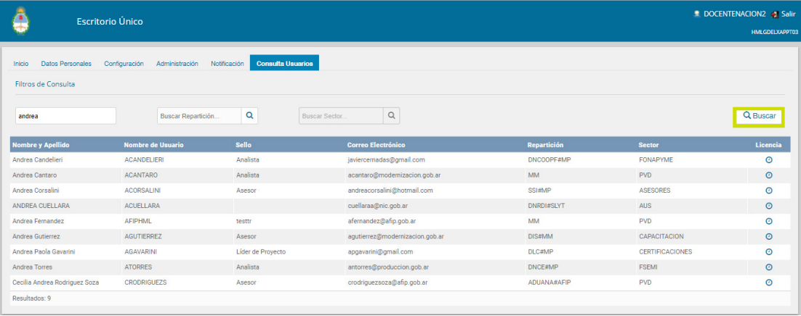
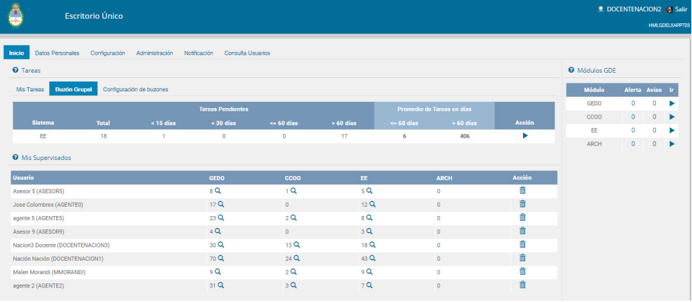

# My Portfolio

## 🧙‍♀️ ExploraML
[ExploraML](https://github.com/qagustina/explora_ml) is my degree thesis. It is a web platform designed to introduce basic machine learning concepts, allowing users to interact with a churn prediction 
dataset and run different supervised learning techniques such as Logistic Regression, Stochastic Gradient Descent, Random Forest, Decision tree and compare their performance.

**Stack**: `Python` `Pandas` `Numpy` `Plotly` `Scikit-learn` `Flask` `SQLite` `Gunicorn` 

## 🌱 Soil Moisture
[Soil Moisture Prediction Project](https://github.com/qagustina/soil_moisture) is a data science project of the Atmospheric Science Research Group [(GICA)](http://gica.exa.unne.edu.ar/) .

- Global Land Data Assimilation System (GLDAS) data mining.
- Data manipulation and transformation.
- Building visualizations of spatio-temporal variables.
- Automation scripts.

**Stack**: `Python` `Numpy` `netCDF4` `Matplotlib`

## 📊 Dashboards Mainteinance 

Maintenance of multiple dashboards for several areas of the company. This assignment required updating the data flows 
that go through automated tasks and manual calculations, as well as updating the visualizations of the different dashboards
and deploy.

Other tasks include:
* Creating visualizations according to new requirements for dashboard in development.
* Query analysis for database migration.
* Technical documentation for developers.

**Stack**: `Tableau` `Tableau Prep` `SQL` `Excel`

## ⚙ Electronic Document Management System (GDE)

[Electronic Document Management System](https://www.argentina.gob.ar/jefatura/innovacion-ciencia-y-tecnologia/innovacion/gde-sistema-de-gestion-documental-electronica) support. 
 Incidents analysis.

_Integrated modules of the GDE system_

* GEDO: Official Documents Electronic Generator
* EE: Electronic File 
* TAD: Remote administration
* LUE: Unique Electronic File 
* LOyS: Lease of Works and Services 
* RLM: Multipurpose File Register
* CCOO: Official Communications.

<h3>GDE - Unique Desk</h3>

  
  

**Stack**: `SQL` `JSON`

---
### 📄 My diplomas and certifications 

| Title                 | Diplomas/Courses  | Link
| :---                  | :---              | ---                 |
| Data Science          | Diploma (UNC)     | [PDF](https://github.com/qagustina/Portfolio/blob/main/resources/diplomas/CertificadosFinales2022%20_AgustinaQuiros.pdf) |
| English language B2   | Diploma (UNNE)    | [PDF](https://github.com/qagustina/Portfolio/blob/main/resources/diplomas/CerificadoB2_AgustinaQuiros.pdf)               |
| Python programming    | Course (UNSAM)    | [PDF](https://github.com/qagustina/Portfolio/blob/main/resources/courses/CertificadoPythonGrado_AgustinaQuiros.pdf) |
| Computer Networking   | Course (UNNE)     | [PDF](https://github.com/qagustina/Portfolio/blob/main/resources/courses/CertificadoInformatica_Agustina%20Quiros.pdf)   |
